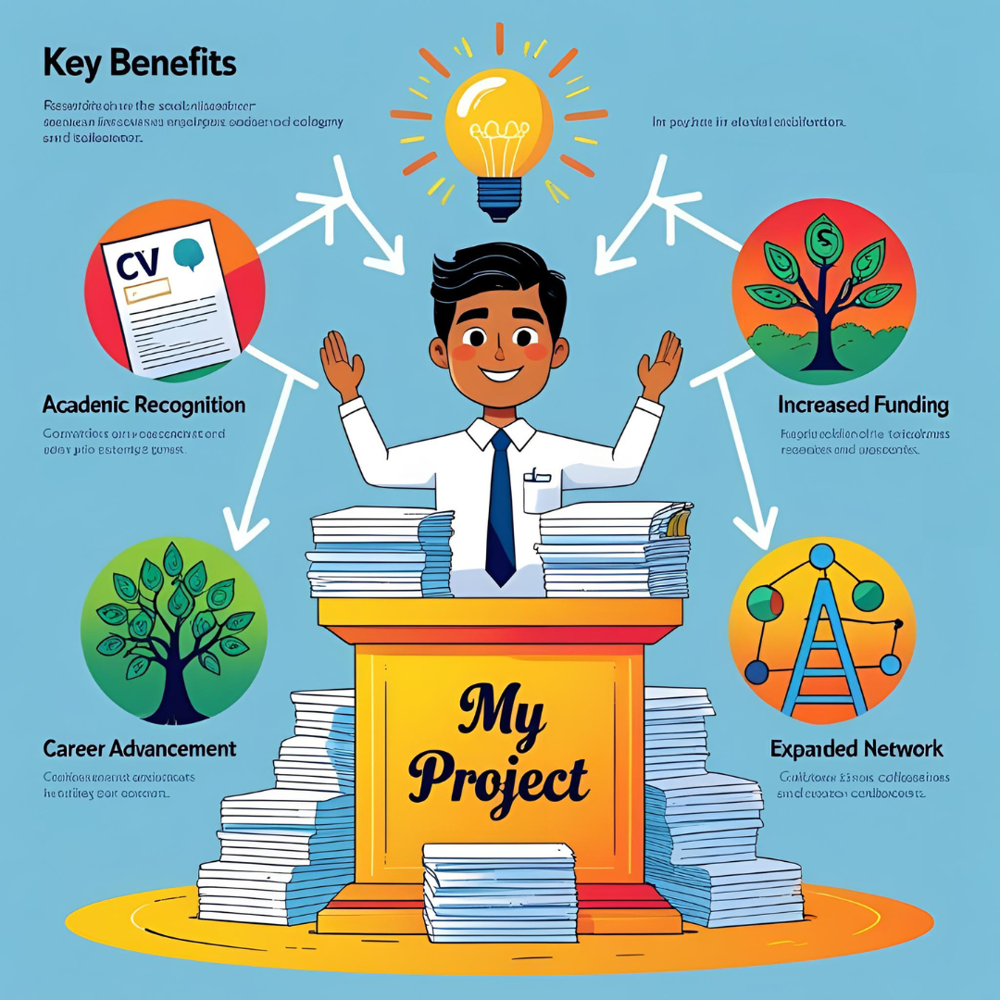

# 📝 From Project to Publication: A Complete Guide to Publishing Your Research Paper

[← Back to Blog](../blog)

---

## ✨ Introduction

For final-year students, researchers, and academic professionals, **publishing a research paper is a career-defining step**. It validates your efforts, enhances credibility, and opens doors to further education, research, and job opportunities.

At **\[Your Startup Name]**, we help you transform your academic project into a **high-impact, publication-ready research paper**—from brainstorming and writing to formatting and submission.

In this guide, we’ll cover:
✅ Why publishing your project matters
✅ Step-by-step process to turn a project into a paper
✅ How we help at every stage
✅ Top journals and conferences to target

---

## 🎯 Why Publish Your Project as a Research Paper?

### 1. 📚 Academic Recognition

* Strengthens your resume for **MS, PhD, or industry roles**
* Boosts **scholarship, grant, and fellowship** opportunities

---

### 2. 🌐 Contribution to Global Knowledge

* Share your innovation with researchers worldwide
* Become a cited author—grow your academic presence

---

### 3. 🔗 Career & Networking Opportunities

* Gain visibility with **universities, companies, and conferences**
* Network with experts and collaborators in your domain

---

### 4. 🏛️ Institutional Prestige

* Student publications boost your college’s **academic ranking**
* Encourages a **culture of innovation and research**

---

## 📌 Step-by-Step Guide: From Project to Publication

### ✅ Step 1: Identify the Research Gap

* Explore platforms like **Google Scholar, IEEE Xplore, Scopus**
* Spot what hasn’t been addressed yet
* Define a clear, focused **research objective**

🔹 *Our Role:* We help analyze literature and shape your problem statement.

---

### ✅ Step 2: Structure Your Paper Strategically

A winning paper typically includes:

1. **Title** – Clear, specific, SEO-optimized
2. **Abstract** – 150–250 words covering the problem, methods, and results
3. **Introduction** – Set context, define problem, state objective
4. **Literature Review** – Showcase gaps in existing research
5. **Methodology** – Tools, technologies, process steps
6. **Results & Discussion** – Visuals, comparisons, analysis
7. **Conclusion & Future Scope** – Final thoughts and what’s next
8. **References** – Proper citations in IEEE/APA format

🔹 *Our Role:* We provide research templates and hands-on editing support.

---

### ✅ Step 3: Conduct Proper Experiments & Collect Valid Data

* Ensure experiments are **reproducible and well-documented**
* Use statistical validation where applicable

🔹 *Our Role:* We assist in graphs, visualizations, and result formatting.

---

### ✅ Step 4: Write & Format Professionally

* Follow formatting guidelines (IEEE, Springer, etc.)
* Use tools like **Grammarly, Turnitin** for accuracy
* Avoid plagiarism, ensure academic tone

🔹 *Our Role:*
✔️ Drafting and paraphrasing support
✔️ Plagiarism checks (<10%)
✔️ Professional formatting (IEEE, APA, etc.)

---

### ✅ Step 5: Choose the Right Journal or Conference

| Category                | Examples                        | Impact       |
| ----------------------- | ------------------------------- | ------------ |
| **SCI/Scopus Journals** | IEEE, Springer, Elsevier        | ⭐⭐⭐⭐⭐ High   |
| **Conferences**         | IEEE CONIT, ICACITE             | ⭐⭐⭐⭐ Good    |
| **UGC-Care Journals**   | Nationally approved journals    | ⭐⭐⭐ Moderate |
| **Avoid**               | Predatory journals (fake, paid) | ❌ No value   |

🔹 *Our Role:* We shortlist top options based on topic, timeline, and budget.

---

### ✅ Step 6: Submission & Reviewer Feedback

* Use the journal’s online submission portal
* Address reviewers’ comments clearly and respectfully

🔹 *Our Role:*
✔ Drafting review responses
✔ Reformatting and revising for re-submission

---

### ✅ Step 7: Promote After Acceptance

* Share your paper on **LinkedIn, ResearchGate, Academia.edu**
* Attend conferences to present your work

🔹 *Our Role:* We provide networking tips and visibility strategies for citations.

---

## 💼 Our Complete Research Paper Support System

### 1. 🎓 Project Evaluation

* Review of project scope, novelty, and publishability

### 2. ✍️ Expert Writing Assistance

* Guided support from **PhD researchers & editors**
* Assistance in structure, writing, and citations

### 3. 🗂 Journal/Conference Shortlisting

* Matching your project with relevant, reputable journals

### 4. 📐 Formatting & Compliance

* IEEE/Springer/Elsevier formatting
* Plagiarism reduction (<10%) with reports

### 5. 📬 Review Assistance

* Help with rewriting based on reviewer feedback
* Professional communication templates

### 6. 🚀 Post-Publication Boost

* Help you reach more readers
* Strategies for increasing citations and visibility

---

## 🛠 Common Challenges We Help You Overcome

| ❓ Problem                           | ✅ Our Solution                                        |
| ----------------------------------- | ----------------------------------------------------- |
| “My project isn’t unique.”          | We identify **new angles, datasets, or comparisons**. |
| “I struggle with academic writing.” | We **rewrite content** in research language.          |
| “Submission is too technical.”      | We handle **end-to-end submission**.                  |
| “My paper got rejected.”            | We **revise & resubmit** with improved methodology.   |

---

## ⭐ Success Stories

* **IoT-Based Smart Campus** → Published in *IEEE IoT Journal*
* **AI Chatbot for Education** → Accepted at *Springer Conference*
* **Blockchain Exam System** → Featured in a *Scopus-indexed Journal*

> “From code to conference—DesignDeliverGrow helped every step.” – *Sandeep, B.Tech Final Year*

---

## ✅ Conclusion

Publishing your academic project isn’t just a dream—it’s **entirely achievable** with expert guidance. Whether you’re just starting or stuck midway, **DesignDeliverGrow** is your trusted partner to get your research out into the world.

🎯 **Want to publish your project?** \[Contact Us Today!]

---

## ❓ Frequently Asked Questions

**Q: How long does it take to publish?**
A: 3–6 months depending on journal review timelines.

**Q: Can you guarantee acceptance?**
A: No one can *guarantee* acceptance, but we **maximize your chances ethically**.

**Q: Do you support IEEE/Springer formatting?**
A: Yes—we specialize in **IEEE, Springer, Elsevier, and APA** styles.

**Q: My project is simple. Can it be published?**
A: Absolutely! Even basic projects can be published with the right **problem framing and enhancements**.
