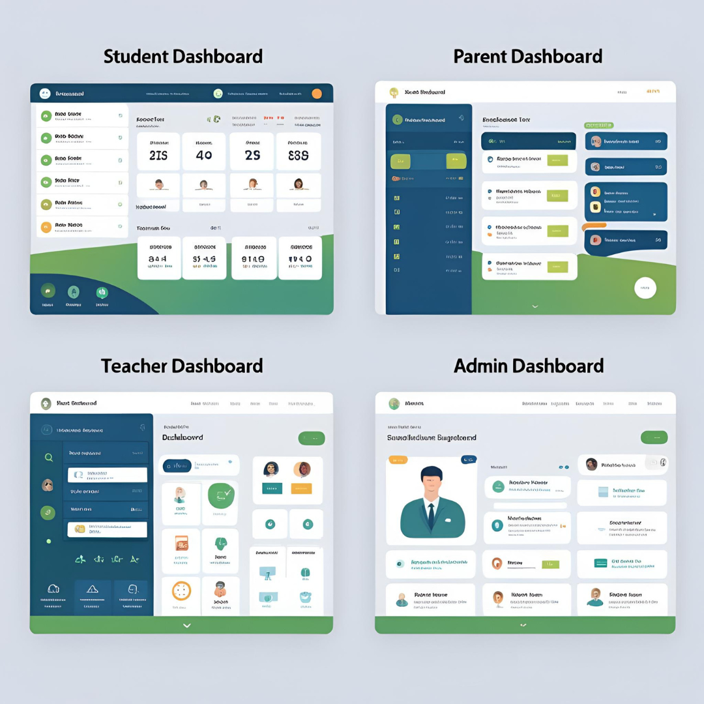

# 🎓 The Ultimate Guide to College & School Websites: Must-Have Features + Best Practices

[← Back to Blog](../blog)

---

## 🚀 Introduction

In today’s digital-first world, a school's or college's **website is more than just a presence—it’s your identity, your communication hub, and your first impression** to students, parents, faculty, and partners.

At **\[Your Startup Name]**, we craft fast, secure, and scalable websites that empower educational institutions to thrive online. This guide will walk you through:

✅ The *why* behind a great website
✅ The *must-have features* every education site should include
✅ Industry *best practices* in design, speed, and security
✅ *How we build* future-ready platforms for schools & colleges

---

## 🎯 Why Every Institution Needs a Professional Website

### 1. 🌟 First Impressions Matter

Your website is the face of your institution. A modern, responsive design:

* Builds trust and credibility
* Influences parents' and students’ decisions within seconds

---

### 2. 🏛️ Centralized Information Hub

From admissions to exam schedules:

* Make all essential information accessible 24/7
* Automate common queries and reduce administrative stress

---

### 3. 👪 Engage Students & Parents

Boost transparency and communication through:

* Dashboards for grades, attendance, and fees
* Newsletters, blogs, and alerts to keep everyone in the loop

---

### 4. 🚀 Recruitment & Branding

Showcase your excellence to the world:

* Attract students, faculty, and strategic partnerships
* Highlight your achievements, alumni, and campus life

---

## 🔧 Must-Have Features for School & College Websites

### 1. 📱 Fully Responsive Design

* Optimized for mobile, tablet, and desktop
* Fast loading, intuitive navigation, and touch-friendly design

---

### 2. 🔐 Role-Based Dashboards

Custom experiences for different users:

* **Students:** Assignments, grades, schedules
* **Parents:** Fee status, attendance, reports
* **Teachers:** Upload materials, manage attendance
* **Admins:** Full access to records, HR, and analytics

---

### 3. 📝 Online Admissions & Enrollment

Simplify the entire process:

* Digital forms with document uploads
* Auto-notifications via email or SMS for application status

---

### 4. 🎓 LMS Integration

Seamless learning experience with platforms like Moodle, Google Classroom, or custom LMS:

* Submit assignments
* Watch video lectures
* Take quizzes and download resources

---

### 5. 📅 Smart Event & Calendar Management

Stay organized and on time:

* Interactive calendar for events, exams, and holidays
* Automated reminders for upcoming activities

---

### 6. 💳 Secure Online Fee Payments

* Support for UPI, cards, and net banking
* Real-time receipts and payment tracking for transparency

---

### 7. 👨‍🏫 Faculty & Staff Directory

Boost trust and discoverability:

* Profiles with photos, expertise, and contact info
* Schedule parent-teacher meetings seamlessly

---

### 8. 🌐 Student & Alumni Portals

Encourage connection and growth:

* Alumni mentoring and job network
* Student portfolios to showcase projects and progress

---

### 9. 📢 News & Announcements

Never miss an update:

* Real-time campus news
* Push notifications for urgent alerts and changes

---

### 10. 🌍 Multilingual Capabilities

Speak your users’ language:

* Support for English + regional/international languages
* Inclusive, accessible communication for all communities

---

### 11. 🛡️ Security & Data Compliance

Protect your users and reputation:

* SSL encryption, DDoS protection, and backups
* GDPR, FERPA, and education-specific compliance standards

---

### 12. 📊 Analytics & Smart Reporting

Make data-driven decisions:

* Track website traffic and user behavior
* Monitor admission conversions and content performance

---

## 💡 Best Practices in Educational Website Development

### ⚡ Speed Matters

* Image optimization, caching, and CDN for lightning-fast load times
* Target: Google PageSpeed score > 90

---

### 🔍 SEO-Optimized for Discovery

* Local SEO to reach nearby students and parents
* Blog integration to boost search rankings in educational queries

---

### ♿ Accessibility for Everyone

* WCAG-compliant for visual and cognitive accessibility
* Keyboard navigation and color contrast compliance

---

### 🌱 Scalable & Future-Ready

* Cloud hosting to handle traffic spikes
* Modular codebase for easy upgrades and feature expansion

---

## 🛠️ How We Build Stunning, Functional Education Websites

At **\[Your Startup Name]**, our process is designed to deliver maximum value with minimal hassle:

### 1. 🎯 Discovery & Planning

* Deep dive into your goals, audience, and brand identity
* Define scope, features, and technology roadmap

### 2. 🖌️ UI/UX Design

* Prototypes and wireframes for stakeholder feedback
* Custom design using brand colors, typography, and style

### 3. 🧱 Development & Testing

* **Frontend:** React.js or WordPress (for CMS ease)
* **Backend:** Node.js or PHP for performance and scalability
* **Database:** MySQL or Firebase for real-time data
* Quality assurance: Speed, security, and device testing

### 4. 🧑‍🏫 Training & Ongoing Support

* Admin training for effortless content management
* Ongoing security updates and 24/7 technical support

---

## 🏁 Conclusion

A powerful website is more than a digital brochure—it’s the heartbeat of your institution's communication, engagement, and operations. Whether you're launching a new school or revamping an existing campus site, **DesignDeliverGrow** helps you stand out with a platform that’s fast, functional, and future-ready.

🚀 **Let’s build the future of education—\[Contact Us Today!]**

---

## ❓ Frequently Asked Questions

**Q: How long does development take?**
A: Most websites are ready within **4-8 weeks**, depending on features and scale.

**Q: Can we manage content ourselves?**
A: Absolutely! We offer training with **WordPress or custom CMS** platforms for easy updates.

**Q: Do you support smart campus integrations (IoT)?**
A: Yes! We support RFID attendance, smart energy monitoring, and more.
