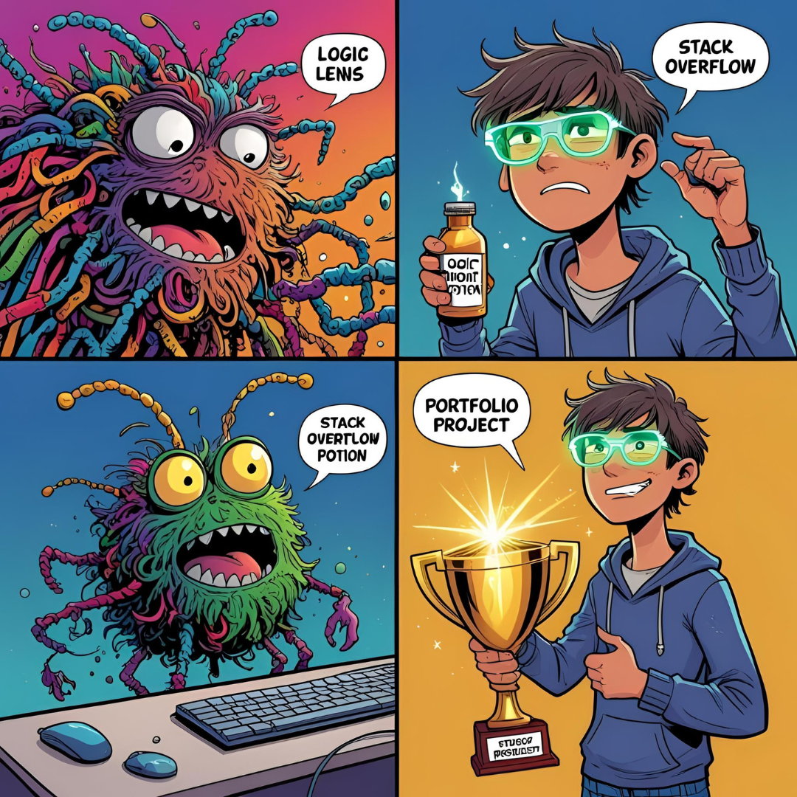
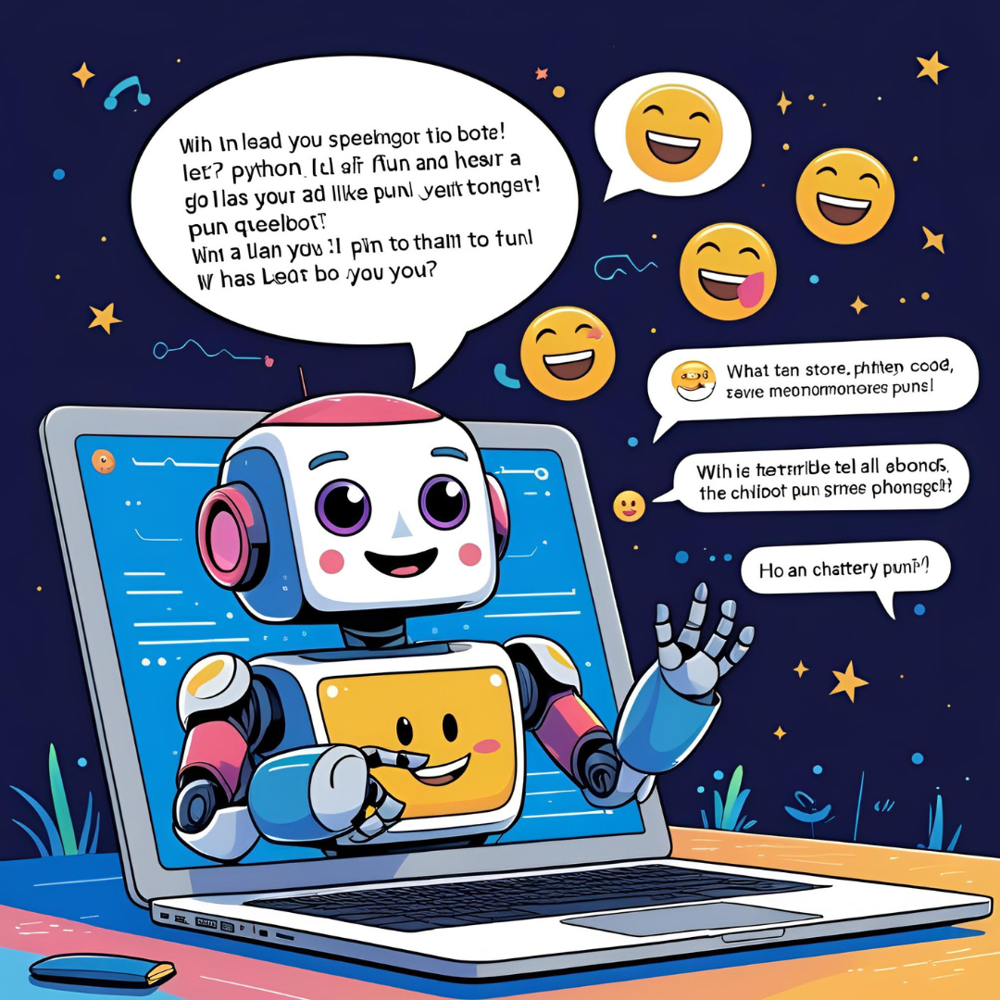
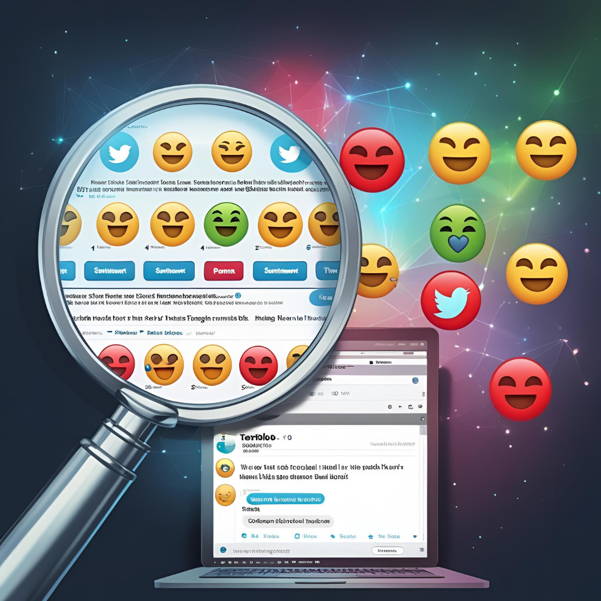
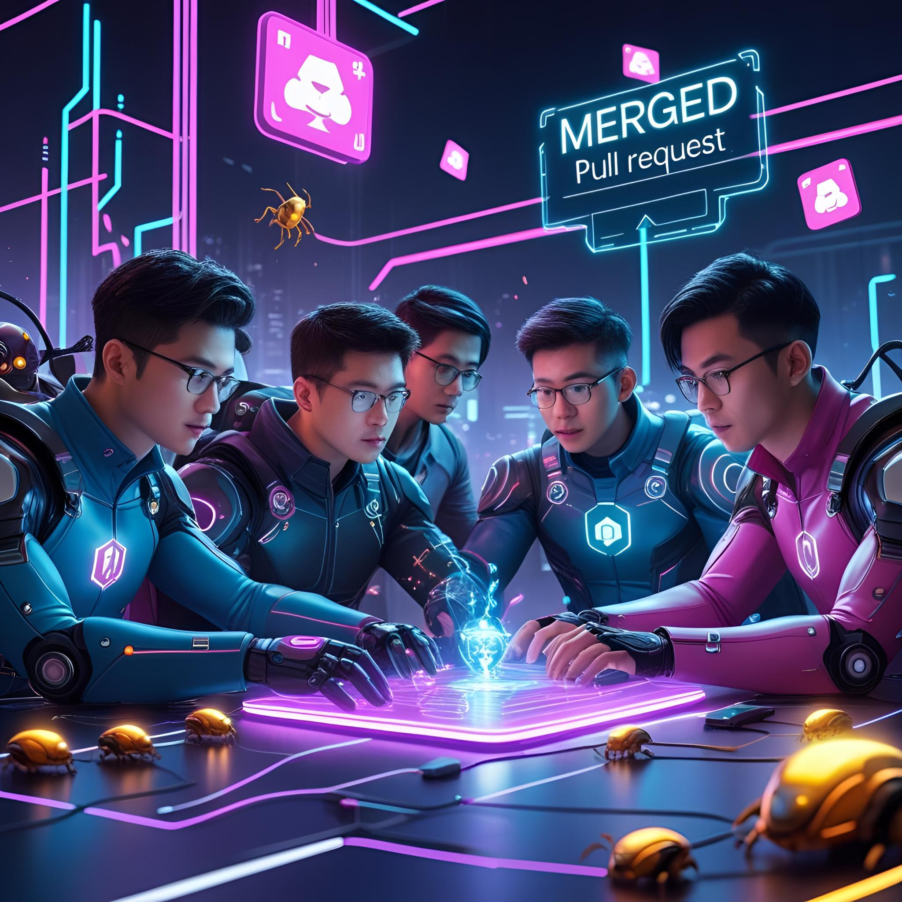
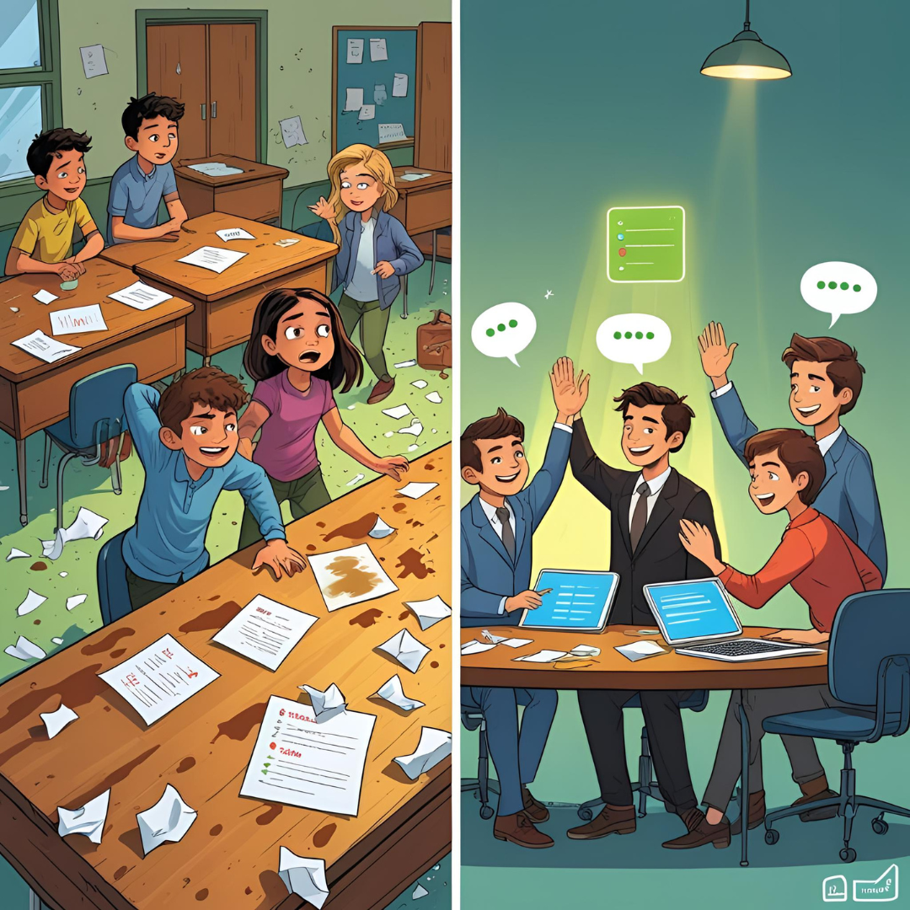
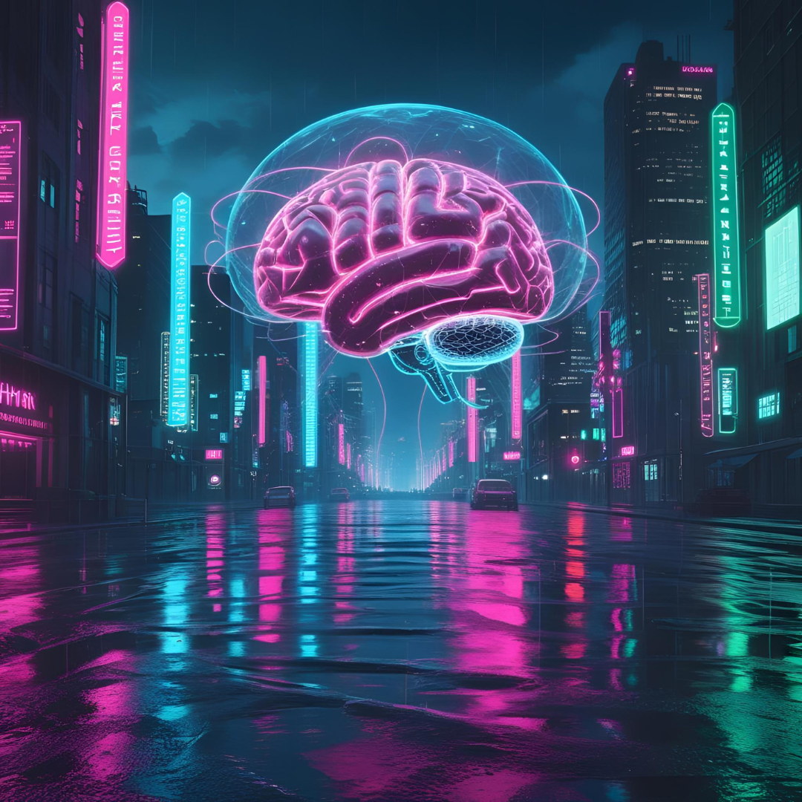
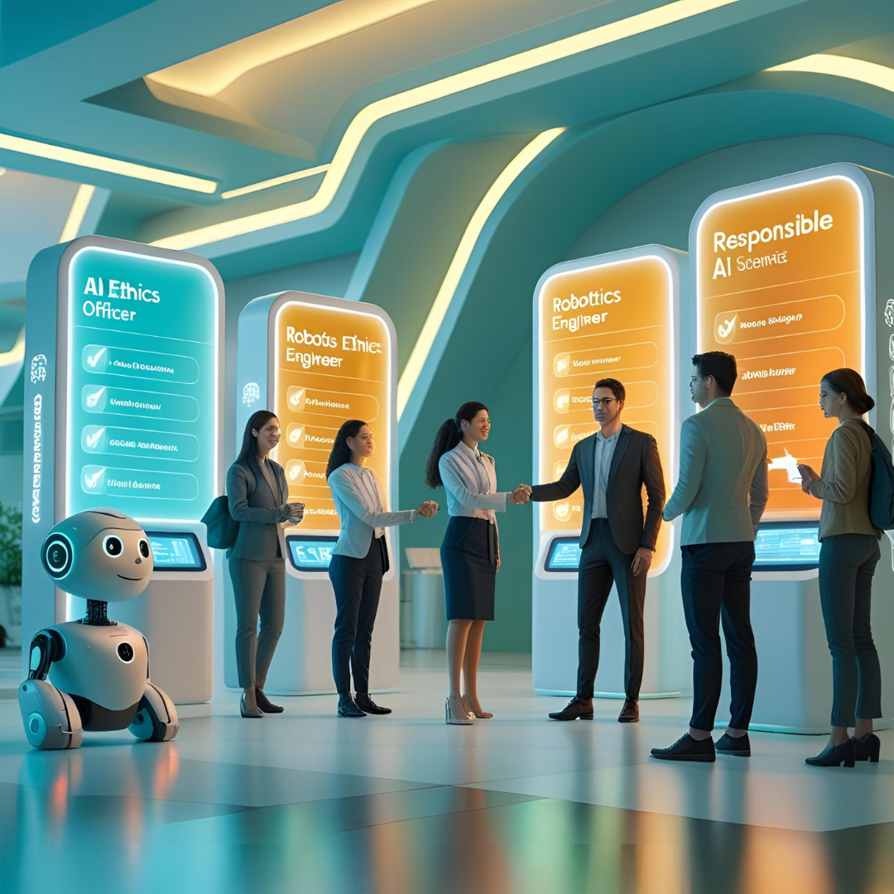

As we step into 2024, the fields of artificial intelligence (AI) and machine learning (ML) continue to evolve at an unprecedented pace, offering exciting opportunities for students eager to explore these transformative technologies. Understanding AI and ML is not just a pathway to a promising career; it’s also a chance to engage with innovative problem-solving approaches that are reshaping industries worldwide. This article presents a curated list of project ideas tailored for students at various skill levels, emphasizing the importance of hands-on experience in mastering these complex subjects. Whether you're just starting out or looking to challenge yourself with advanced projects, this guide will help you unlock your potential and gain valuable insights into the future of AI and machine learning.

# AI & Machine Learning Project Ideas for Students in 2024

## Introduction to AI and Machine Learning for Students
[← Back to Blog](../blog)
### What is AI and Machine Learning?
Artificial Intelligence (AI) is the fancy term we use when computers mimic human intelligence. Think of it as a really smart assistant that can learn and make decisions. Machine Learning (ML), on the other hand, is like the little sibling of AI. It's the branch that teaches computers how to learn from data without being explicitly programmed. If you’ve ever wondered how Netflix knows what you want to binge-watch next or how your phone can recognize your face, you’re experiencing the magic of AI and ML!

### Current Trends in AI Education
As we stride into 2024, AI education is evolving faster than you can say “machine learning algorithm.” With the rise of online courses and the smashing together of disciplines like data science and psychological behaviors, students are learning AI not just in computer science classes, but also in fields like arts, business, and healthcare. Plus, hands-on projects and competitions—think hackathons—are making sure learning stays exciting. Who knew algorithms could be so thrilling?

## Importance of Hands-On Projects in Learning

### Bridging Theory and Practice
Picture this: you’ve memorized the theory of neural networks, but when it comes to applying it, your brain turns into mush. That’s where hands-on projects step in. They help bridge the yawning chasm between textbook knowledge and real-world application. By tackling practical challenges, you not only reinforce what you've learned, but also get to flex those creative muscles. It’s like the difference between just reading about how to ride a bike versus actually pedaling down the street with a fresh breeze in your hair.

### Building Problem-Solving Skills
Nothing says “I’m ready for the real world” quite like the ability to solve problems. And hands-on projects are your personal gym for that skill! By facing challenges in your projects, you’ll develop critical thinking and adaptability—two skills that will serve you well in any career, especially if you aim to tackle the rogue robots of the future. Plus, you’ll gain a tangible portfolio piece to flaunt to future employers, which is way cooler than just saying you know how to do stuff.

## Beginner-Level Project Ideas

### Simple Chatbot Development

Who wouldn’t want to build their own chatbot? Start with simple frameworks like Python’s ChatterBot or Microsoft Bot Framework. You can create a virtual buddy that chats about the weather, provides homework help, or helps you practice your terrible puns. This project is a great way to learn the basics of natural language processing while having fun—and who knows, maybe your bot will become a sensation at the next family gathering!

### Image Classification with Basic Datasets
Get those creative juices running by diving into image classification! Using datasets like MNIST (hello, handwritten digits!) or CIFAR-10 (adorable little animals), you can train a model to identify and classify images. It’s like teaching your computer to see, and the best part is, you get to play around with different algorithms. Plus, you can impress your friends by telling them your model not only knows a cat from a dog, but it also knows how to differentiate between a hotdog and a not-hotdog.

## Intermediate-Level Project Ideas

### Sentiment Analysis of Social Media Data

Ready for a project that’ll make you feel like a tech-savvy detective? Dive into sentiment analysis! By analyzing Twitter or Facebook posts, you can uncover the public mood on various topics, like which pizza place has the best slice (spoiler: it’s always about the toppings). Utilize libraries such as NLTK or TextBlob to get into the nitty-gritty. Plus, you’ll not only sharpen your coding skills but also develop an understanding of public opinions, which could be a game-changer if you ever dabble in marketing!

### Predictive Modeling with Regression Techniques

Welcome to the world of forecasting! In this project, you’ll use regression techniques to predict future outcomes based on historical data. Whether you aim to predict home prices, stock movements, or how many slices of pizza are consumed at a party (a crucial metric), this will flex your analytical muscles. By exploring libraries like Scikit-Learn, you can fit models and improve accuracy—making you the Oracle of Predictive Modeling in your friend group (or at least until the next trend comes along).

With these project ideas in your toolkit, you're all set to dive deeper into the fascinating world of AI and ML. Remember, every expert was once a beginner, so roll up those sleeves and get building!# AI & Machine Learning Project Ideas for Students in 2024

## Advanced-Level Project Ideas

### Neural Network for Handwritten Digit Recognition

Ready to dive deep into the world of neural networks? Create a project that recognizes handwritten digits (because who doesn’t have a soft spot for numbers?). Using the MNIST dataset, you can train a neural network to classify digits from 0 to 9, which is basically like teaching your computer how to read your notes. You’ll grapple with concepts like overfitting and activation functions while feeling like a digital Picasso painting a masterpiece of algorithms. Plus, it’s all about that sweet, sweet accuracy—the higher, the better!

### AI-Powered Game Development

Unleash your inner game designer as you harness AI to create a truly unique gaming experience. Instead of the usual “press start and hope for the best,” imagine a game that adapts to player behavior, allowing for personalized challenges and dynamically generated content. You could incorporate machine learning algorithms that learn from player actions or even create non-player characters (NPCs) with personalities that evolve over time. This is your chance to be the game god you always dreamed of being—just make sure your game doesn’t end up being too perfect; after all, we all love a little bit of chaos!

## Collaborative Projects for Enhanced Learning

### Team-Based Data Science Challenges

They say teamwork makes the dream work, and it holds true for AI projects too! Form a squad and tackle data science challenges that mimic real-world scenarios. Think hackathons or competitions where you develop models to solve problems like predicting house prices or identifying fraudulent transactions. Not only will you learn the ins and outs of working with data, but you’ll also get to practice those all-important collaboration skills—like learning to share snacks and resisting the urge to silently judge your teammate’s “creative” coding style.

### Open Source Contributions in AI

Get your hands dirty with open source contributions! Not only will you be helping the community, but you’ll also gain practical experience while working on real projects. Choose from a myriad of AI-related repositories on platforms like GitHub and jump in to fix bugs, add features, or even improve documentation. It’s like being part of a digital superhero team, fighting the villains of inefficiency and obscurity, all while enhancing your CV. Plus, you get bragging rights for being a part of something bigger!

## Tips for Successfully Executing AI Projects

### Choosing the Right Tools and Technologies

With great power comes great responsibility—and also a plethora of tools to choose from! When embarking on your AI adventures, make sure to select the right tech stack. Python is the go-to language, but don’t forget about the libraries—TensorFlow, PyTorch, and Scikit-learn are your trusty allies. Each tool has its strengths, so consider your project goals before you decide. Otherwise, it’s like picking a tool from a kitchen drawer and ending up with a butter knife when you need a chef’s knife. Yikes!

### Effective Project Management Strategies

No one wants to relive that group project in sixth grade where everything fell apart. So, let’s avoid that! Keep your project on track by employing effective project management techniques. Break your work into manageable chunks, set timelines, and use platforms like Trello or Asana to keep everyone accountable and on the same page. Regular check-ins can also help keep motivation high (because nothing says “team spirit” like a synchronized project update). Remember, a little organization goes a long way—plus, it helps prevent spontaneous chaos!

## Future Trends in AI and Machine Learning for Students

### Emerging Technologies to Watch

Keep your eyes peeled for the next big thing in AI! In 2024, technologies like federated learning, explainable AI, and augmented reality are set to take center stage. Federated learning helps in training models on decentralized data, giving privacy a big high-five, while explainable AI seeks to make those seemingly magical algorithms more transparent. And augmented reality? Let’s just say the future looks even cooler when your AI can help you interact with the world through immersive experiences. You’re basically living in a sci-fi movie—minus the dramatic music.

### Career Opportunities in AI and ML

As the AI landscape evolves, so do career opportunities that’d make even your career counselor raise an eyebrow! From data scientists to AI ethics officers, the job market is ripe with positions waiting for enthusiastic freshers. Companies are on the lookout for talent that can bridge the gap between technical expertise and ethical considerations. So, whether you want to build the next revolutionary app or ensure AI remains friendly and ethical, there’s a place for you in this exciting world. Just remember, keep learning and adapting—because in AI, staying still is not an option!In conclusion, embarking on AI and machine learning projects is an invaluable way for students to deepen their understanding and practical skills in these dynamic fields. Whether you choose to tackle beginner, intermediate, or advanced projects, each experience will contribute to your growth as a budding technologist. As you explore these ideas and create your own unique projects, remember that the journey of learning is just as important as the outcomes. Embrace the challenges, collaborate with peers, and stay curious—these are the keys to thriving in the ever-evolving world of AI and machine learning. Happy coding!

Frequently Asked Questions (FAQ)

1. What programming languages should I be familiar with for AI and machine learning projects?

Most AI and machine learning projects commonly utilize languages such as Python, R, and Java. Python is particularly popular due to its extensive libraries and user-friendly syntax, making it an excellent choice for beginners.

2. Do I need a strong math background to work on AI and machine learning projects?

While a solid understanding of mathematics, especially statistics and linear algebra, can be beneficial, many resources and tools are available to help you grasp the necessary concepts as you work on projects.

3. How can I find datasets for my AI projects?

There are numerous online platforms where you can find datasets, such as Kaggle, UCI Machine Learning Repository, and Google Dataset Search. These resources offer a wide variety of datasets suitable for different types of projects.

4. Can I collaborate with others on AI projects, and how can I do that?

Absolutely! Collaboration can enhance your learning experience. You can join online communities, participate in hackathons, or contribute to open-source projects on platforms like GitHub to work with others who share your interests in AI and machine learning.