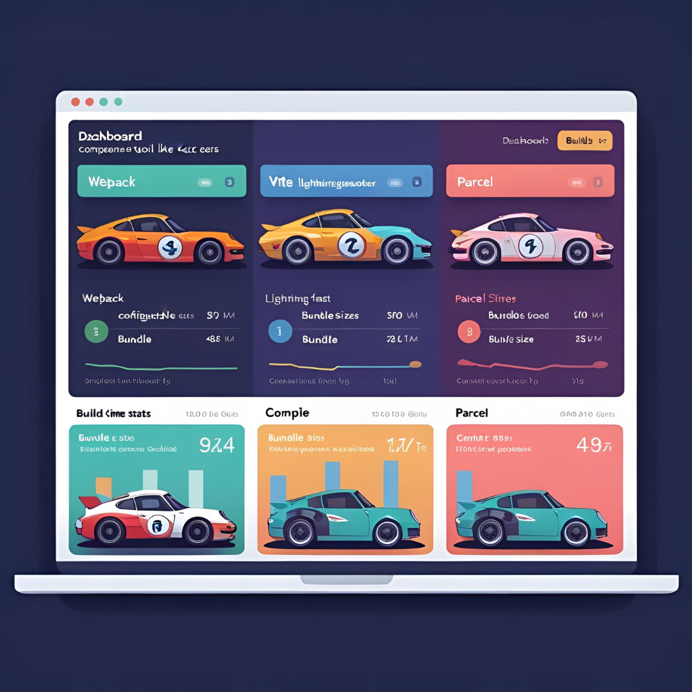
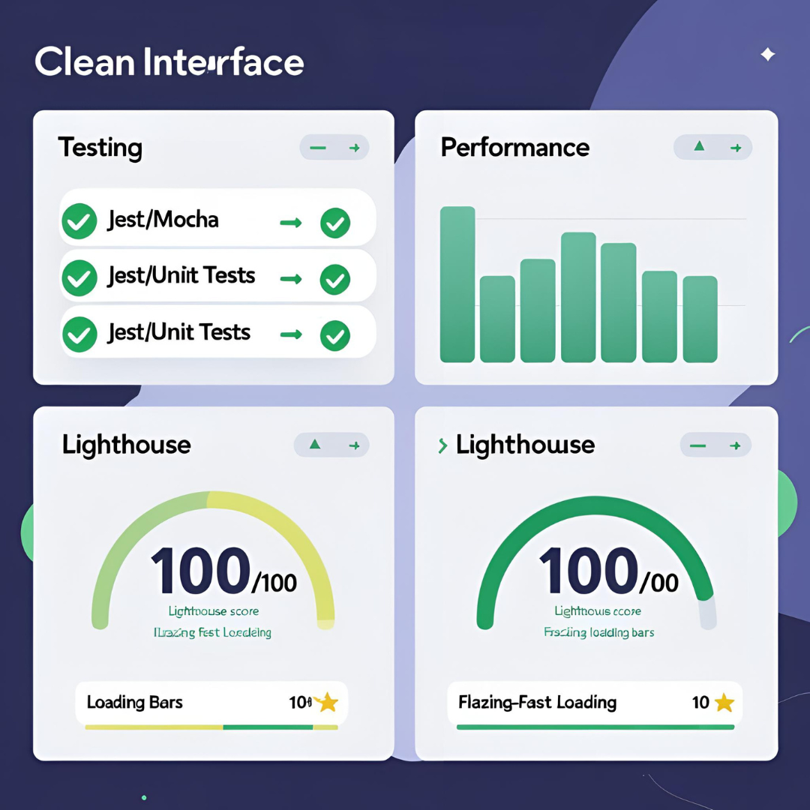
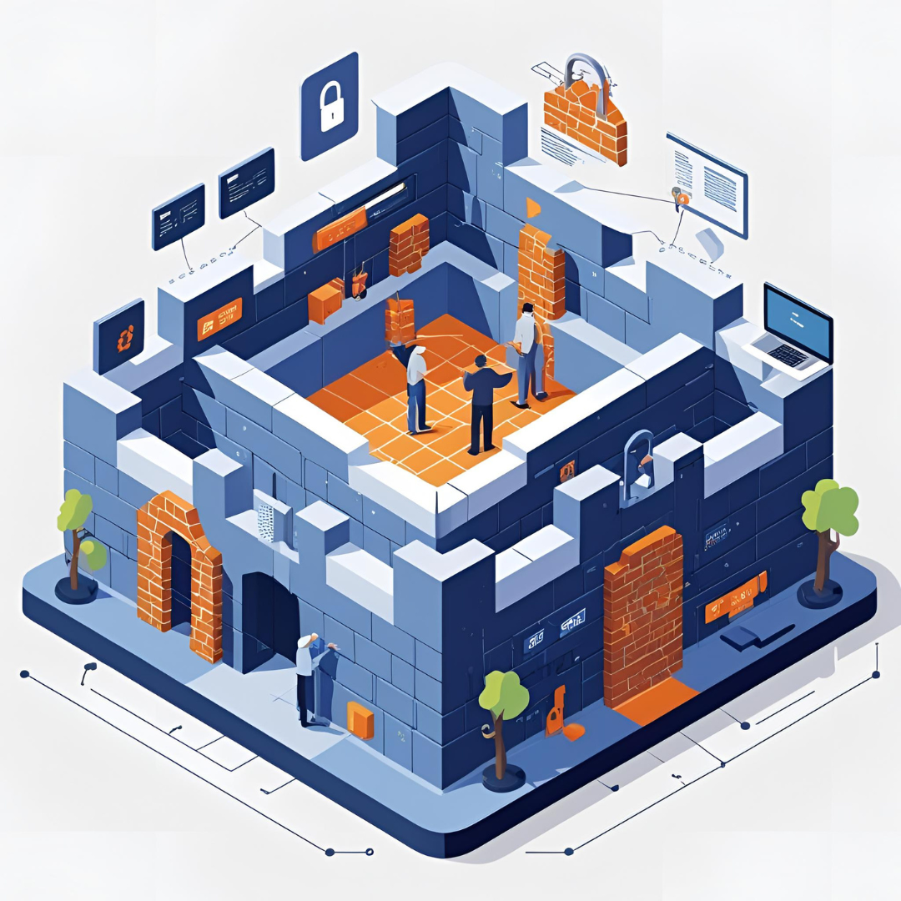
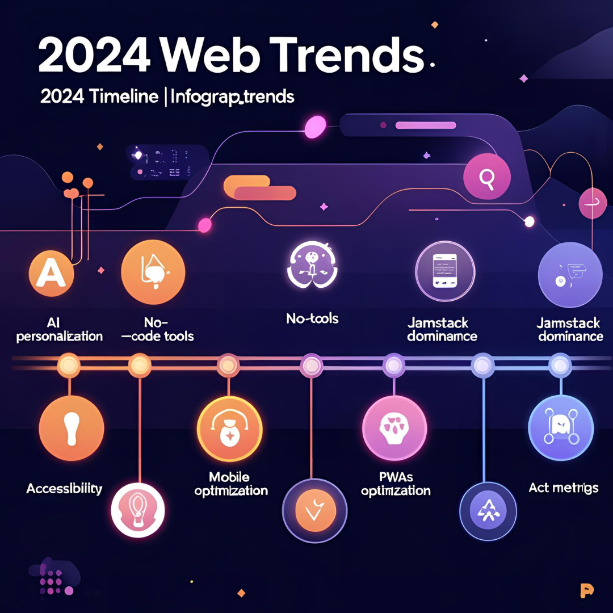

In the fast-evolving world of technology, web development remains at the forefront of innovation, constantly adapting to new demands and user expectations. As we step into 2024, developers and businesses alike must navigate an intricate landscape filled with emerging technologies, evolving trends, and best practices that will shape the web experiences of tomorrow. This complete guide aims to equip you with a comprehensive understanding of the current state of web development, from the essential tools and frameworks driving the industry to the critical focus on user experience and security. Whether you are a seasoned developer looking to stay ahead of the curve or a newcomer eager to explore the possibilities, this article will serve as your roadmap to mastering web development in the year ahead.

# Complete Guide to Web Development in 2024: Technologies, Trends & Best Practices

## Introduction to Web Development in 2024
[← Back to Blog](../blog)
### Overview of the Web Development Landscape
Welcome to 2024, where web development is more vibrant than ever! If the web were a party, it would be an all-out rave, juggling frameworks, libraries, and shiny new technologies. Gone are the days of static websites; now, we’re talking about dynamic, immersive user experiences that can make your grandma think she’s in a sci-fi movie. As we step into the new year, developers are greeted with an ever-evolving landscape fueled by innovative technologies and user-centric designs. So grab your virtual toolkit, because it's time to dive into the nitty-gritty of what’s hot (and what’s not) in web development!

### The Importance of Staying Updated
In a world where yesterday's cutting-edge technology could easily become today’s dusty relic, keeping up with the latest trends and tools is crucial. If you’ve ever tried to explain to your grandma why you’re still using that “old” JavaScript library (she doesn't care about your nostalgia, by the way), you understand the importance of staying updated. Embracing new technologies not only boosts your skills but also ensures your projects remain relevant and effective. Plus, staying in-the-know makes you the go-to guru at every 2 a.m. developer meet-up. Trust me, those late-night coffee-fueled discussions will be a lot more enjoyable when you know the latest web buzz!

## Key Technologies Shaping Web Development

### Front-End Technologies: Frameworks and Libraries
When it comes to the visual side of things, front-end development is where the magic happens—and boy, do we have some spellbinding tools at our disposal in 2024! Frameworks like React, Vue.js, and Angular are still strutting their stuff, helping developers create intuitive and engaging user interfaces. JavaScript libraries are also getting their well-deserved spotlight moment, with new players surfacing that promise to make your development process smoother than ever. So whether you’re crafting dazzling animations or ensuring your site loads faster than a cheetah on roller skates, the front-end tech scene has you covered!

### Back-End Technologies: Server-Side Innovations

While the front-end is all about glitz and glamour, the back-end is like the unsung hero of web development—handling the heavy lifting behind the scenes. This year, server-side innovations are bringing some exciting changes to the world of back-end development. Languages like Node.js, Python, and Go are continually evolving, offering faster and more efficient ways to process data. And let’s not forget about the rise of serverless architectures and microservices, allowing developers to build scalable applications without the headache of managing servers. If the back-end were a superhero, it would definitely be the one wearing glasses at a computer, doing all the important work while the front-end gets all the glory!

### Databases and Data Management Tools

Data is the lifeblood of the web, and if you want your applications to thrive, you must choose the right data management tools. In 2024, traditional databases like MySQL and PostgreSQL are still strong contenders, but NoSQL options like MongoDB and Firebase are putting up a fierce competition. With the increasing emphasis on real-time data processing and efficient storage solutions, developers have a cornucopia of databases to choose from. Just remember: a well-structured database is like a well-organized closet—finding what you need is way easier when the chaos is contained!

## Emerging Trends to Watch This Year

### Progressive Web Applications (PWAs)
.png)
As we forge ahead into 2024, Progressive Web Applications (PWAs) are gaining traction like a runaway train. Combining the best of web and mobile apps, PWAs load quickly, work offline, and provide a native app-like experience. Think of them as the Swiss Army knife of applications, offering versatility and convenience. So if you’re still living in the heyday of traditional websites, it might be time to embrace the PWA revolution and ensure your projects keep pace with user expectations. After all, nobody wants a website that plays hard to get!

### Responsive and Adaptive Design Techniques

With users accessing websites on an ever-expanding variety of devices—from smartwatches to 80-inch TVs—responsive and adaptive design techniques are table stakes for 2024. Designers are increasingly prioritizing fluid layouts and flexible images that seamlessly adapt to different screen sizes. It’s like dressing for a first date: you want to impress no matter what outfit you end up in! So, don’t forget to keep your designs adaptable to ensure a delightful user experience on any device.

### Artificial Intelligence in Web Development

Artificial Intelligence (AI) is the tech industry's shiny new toy, and web development is no exception. From chatbots that can answer customer queries faster than you can say “Hello, World” to AI-driven design tools that assist in creating stunning layouts, AI is transforming how we approach web projects. In 2024, leveraging AI technologies can streamline your workflow and enhance user experience in ways that were previously the stuff of science fiction. So, if you haven’t started dabbling in AI yet, now’s the perfect time to embrace its magical powers!

## Best Practices for Modern Web Development

### Code Quality and Maintainability

In web development, writing clean, maintainable code is like keeping your kitchen tidy: it might feel tedious in the moment, but it pays off later when you’re not hunting for that missing spatula (or debugging your code!). Following best practices like proper formatting, modular code, and thorough documentation can make your life a whole lot easier. Plus, maintaining high code quality keeps your projects scalable and reduces the chances of future headaches.

### Version Control and Collaboration

No developer is an island, and thanks to version control systems like Git, collaborating on projects is easier than ever. Git allows you to track changes, manage multiple versions of your code, and collaborate with other developers without the risk of stepping on each other’s toes. Think of it as having a superpower that lets you rewind time and fix things before they go haywire. So if you haven’t embraced version control yet, now’s the time to jump on the bandwagon. Your future self will thank you!

### Accessibility Standards and Guidelines

Finally, let’s talk about accessibility because every web user deserves a fantastic experience—regardless of their ability. Following accessibility standards and guidelines not only broadens your audience but ensures that everyone, including users with disabilities, can navigate and enjoy your site. Simple practices like using semantic HTML, providing alt text for images, and ensuring good color contrast can elevate your web game to new heights. Remember: an inclusive web is a happy web!

And there you have it! With these technologies, trends, and best practices in mind, you’re all set to conquer the web development world in 2024 like the rock star you are. Happy coding!# Complete Guide to Web Development in 2024: Technologies, Trends & Best Practices

## Essential Tools and Frameworks for Developers

### Popular Development Environments and IDEs

In the ever-evolving world of web development, choosing the right environment can feel as critical as choosing the right pair of shoes for a marathon—get it wrong, and you're in for a long, uncomfortable ride! In 2024, Visual Studio Code continues to reign supreme, thanks to its extensive extensions that cater to every developer's whim. JetBrains' WebStorm is also a top pick, known for its intelligent coding assistance and built-in tools. If you're feeling nostalgic, Atom still has its fans, proving that sometimes, you just can’t let go of your old friend.

### Task Runners and Build Tools

Let’s face it: if you’re still doing your tasks manually, you’re living in the 90s. Enter task runners and build tools—your new best pals. In 2024, Gulp and Grunt are still around, but the cool kids have moved on to Webpack, Parcel, and Vite. These tools streamline your workflow, allowing you to automate tasks like minifying files, compiling Sass, and reloading your browser when you make changes. They’re like having an assistant who never takes a coffee break and always delivers on time.

### Testing Frameworks and Performance Tools
Nobody likes a buggy website, right? That’s where testing frameworks and performance tools come in to save the day! In 2024, Jest and Mocha will continue to dominate unit testing while Cypress and Selenium hold the reins for end-to-end testing. On the performance side, tools like Google Lighthouse and GTmetrix are essential for ensuring your site loads faster than a kid racing to the ice cream truck. Remember: a smooth experience is key, so embrace these tools like you would a warm cup of coffee on a Monday morning.

## The Role of User Experience (UX) in Web Development

### Understanding User-Centered Design
User-centered design is the golden rule of web development—think of it as the North Star guiding you through the galaxy of preferences and behaviors of your users. In 2024, embracing this approach means involving users from the get-go. It’s about creating an emotional connection and ensuring that every button, link, and color scheme makes them feel like royalty rather than peons. Just remember: a happy user is a returning user—so keep those smiles on!

### Tools for UX Research and Prototyping
Are you ready to dive deep into the user psyche? In 2024, tools like Figma, Sketch, and Adobe XD will be your trusty sidekicks, allowing you to create stunning prototypes and wireframes. Not to mention, platforms like UsabilityHub and Typeform are stellar for gathering user feedback. Think of it like a digital focus group that doesn’t require pizza and soda. With these tools, you can iterate designs faster than you can say “I forgot my password.”

### Measuring User Engagement and Feedback

So, you launched your site and now you're cringing at the thought of whether anyone even bothered to click those shiny new buttons. Fear not! Analytics tools like Google Analytics, Hotjar, and Mixpanel are your best friends for measuring user engagement. They provide valuable insights into what users are actually doing on your site (or not doing—yikes). Remember to keep an eye on that feedback; it’s the best route to refining user experience and ensuring your visitors don’t ghost you after the first visit.

## Security Considerations for 2024 Web Projects

### Common Security Threats and Vulnerabilities

In the wild west of the internet, bad actors are always lurking around the corner—think of them as the grumpy neighbor with a garden full of booby traps. In 2024, common threats include cross-site scripting (XSS), SQL injection, and data breaches. Keeping your web app secure is crucial, not just for you, but for your users too. After all, if your website becomes the new favorite playground for hackers, you’ll be in for some serious trouble.

### Best Practices for Secure Development

To keep those pesky hackers at bay, best practices for secure development are an absolute must. Regularly update your software, implement HTTPS, and validate user inputs like your mother checks your bank statements—thoroughly. Use security headers and ensure your APIs are fortified with authentication and authorization checks. It’s a lot like securing your home: you wouldn’t leave the front door wide open, so don’t leave your web app vulnerable!

### Compliance with Data Protection Regulations

As we tread deeper into 2024, compliance with data protection regulations (like GDPR and CCPA) is like putting on a seatbelt—it's necessary for everyone’s safety. Make sure your website has clear privacy policies, collects only necessary data, and allows users to opt-out of tracking, because nobody likes being followed around online. Remember, the key to a trusting relationship with your users is transparency, and nobody wants to be the shady character in an episode of "Dateline."

## Future Predictions: The Next Frontier of Web Development

### Trends Shaping the Next Decade

As we glance toward the horizon, several trends are poised to shape the future of web development. In 2024, we can expect even greater emphasis on accessibility, mobile-first design, and AI-driven personalization. The rise of low-code/no-code platforms is empowering non-developers to create, making the digital landscape more inclusive. And let's not forget about the meteoric rise of JAMstack—it's safe to say that static sites are here to stay!

### The Impact of Quantum Computing on Web Development
Hold onto your hats, because quantum computing is coming for your code faster than a caffeinated squirrel. In this brave new world, developers may find themselves optimizing algorithms in ways they never imagined. While we’re still a bit in the dark about how this will play out, it’s clear that embracing quantum computing could dramatically boost performance and security. Just be prepared for some serious brain gymnastics!

### Preparing for the Metaverse in Web Experiences
As we venture into the Metaverse, web development is set to get a serious upgrade. It’s no longer just about websites; it’s about crafting immersive experiences. In 2024, developers will need to learn new technologies like WebXR and 3D modeling to create virtual spaces that users can interact with. Get ready to embrace avatars, virtual reality, and augmented reality as you prepare to launch your projects into this brave new world. Welcome to web development 2.0, where the boundaries of reality may just blur away!As we conclude our exploration of web development in 2024, it's clear that the landscape is rich with opportunities and challenges. By embracing the latest technologies, staying informed about emerging trends, and adhering to best practices, developers can create innovative and engaging web experiences that meet the needs of users. Whether you’re enhancing your current skills or starting fresh, the insights shared in this guide will help you navigate the dynamic world of web development. Remember, staying adaptable and open to learning will be key to thriving in this ever-changing field. Here’s to a successful year of web development ahead!

Frequently Asked Questions (FAQ)

What are the most important technologies to focus on in web development for 2024?

The most important technologies for 2024 include modern JavaScript frameworks like React and Vue.js for front-end development, Node.js for back-end processes, and cloud technologies for deployment. Additionally, familiarity with AI tools and Progressive Web Apps (PWAs) is becoming increasingly valuable.

How can I ensure my web applications are secure?

To ensure security in your web applications, it's essential to follow best practices such as regular security audits, implementing HTTPS, validating user input, and keeping all software and libraries updated. Familiarity with common vulnerabilities like SQL injection and cross-site scripting (XSS) is also crucial.

What role does user experience (UX) play in web development?

User experience (UX) is critical in web development as it directly impacts user satisfaction and engagement. A well-designed UX can lead to higher conversion rates and improved user retention. This involves understanding user needs, conducting usability testing, and continually iterating on designs based on user feedback.

Are there specific resources or tools recommended for beginners in web development?

Yes, beginners can benefit from resources such as online coding platforms like Codecademy and freeCodeCamp, as well as tools like Visual Studio Code for coding, GitHub for version control, and Figma for design. Joining online communities and forums can also provide valuable support and guidance.